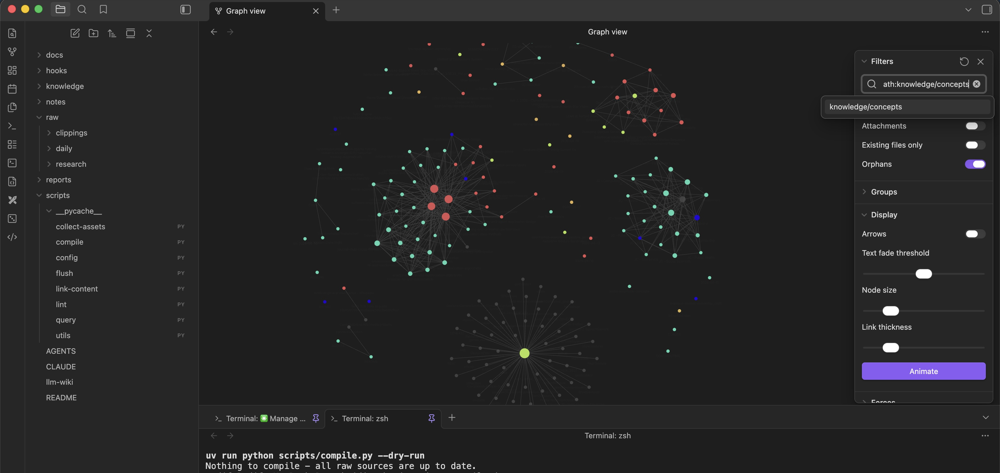
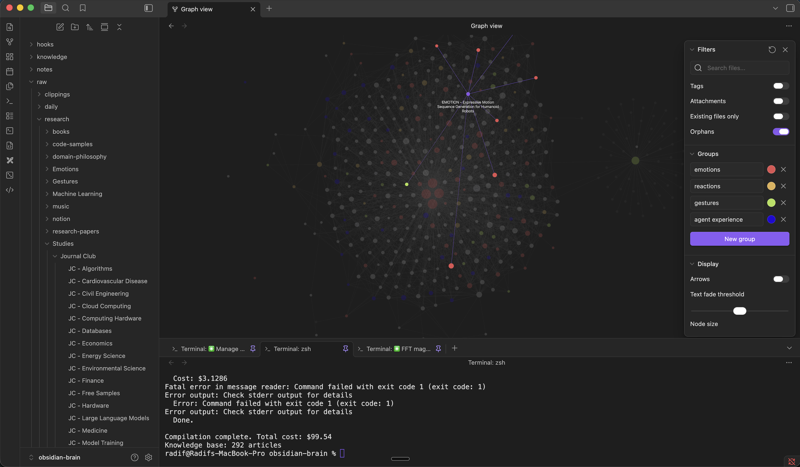
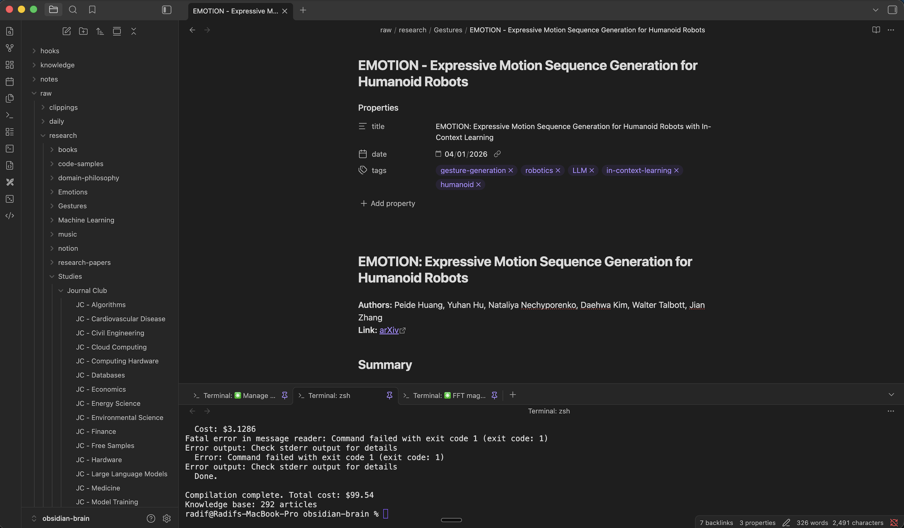
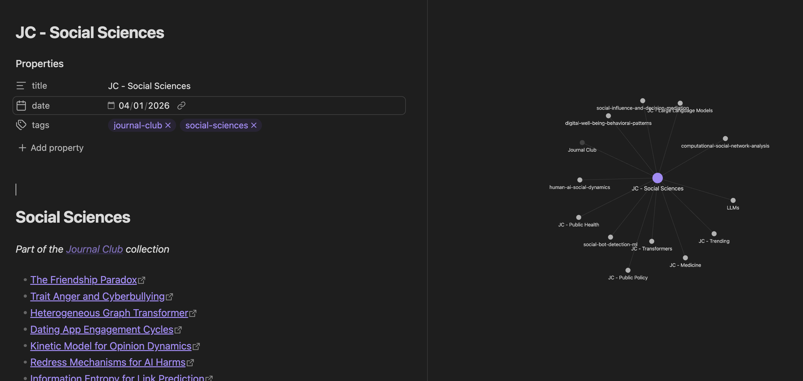

# LLM Personal Knowledge Base

**Your AI conversations compile themselves into a searchable knowledge base.**

Wanted to share a pattern that's been working well for me.

I asked Claude to create a slash command — `/connect-obsidian-brain` at the user level — which loads the context of this self-compiling knowledge base into any project I'm working in: how I look at problems, my coding style, and my angle of attack.

This lets me get away with casual prompts, not repeat myself, and still have Claude Code deliver good and predictable results. Would love any feedback.

---

The approach is adapted from [Karpathy's LLM Knowledge Base](https://gist.github.com/karpathy/442a6bf555914893e9891c11519de94f), but instead of clipping web articles, the raw data is your own conversations with Claude Code. When a session ends (or auto-compacts mid-session), Claude Code hooks capture the conversation transcript and spawn a background process that uses the [Claude Agent SDK](https://github.com/anthropics/claude-agent-sdk) to extract the important stuff — decisions, lessons learned, patterns, gotchas — and appends it to a daily log. You then compile those daily logs into structured, cross-referenced knowledge articles organized by concept. Retrieval uses a simple index file instead of RAG — no vector database, no embeddings, just markdown.

Anthropic has clarified that personal use of the Claude Agent SDK is covered under your existing Claude subscription (Max, Team, or Enterprise) — no separate API credits needed. Unlike OpenClaw, which requires API billing for its memory flush, this runs on your subscription.

## Screenshots

The graph filtered down to `knowledge/concepts` — only compiled concept articles and their `[[wikilinks]]`, with `just compile-dry` confirming the cache is up to date.



The compiled knowledge base viewed in Obsidian — nodes are concept articles, edges are `[[wikilinks]]`. The terminal shows `just compile` promoting raw sources into articles.



A compiled concept article rendered in Obsidian's reading view — YAML frontmatter surfaces as structured properties (title, date, tags), and the body cites its `raw/` sources inline.



A note viewed alongside its local graph (pane linked to the active note, so the neighborhood view follows you as you navigate). Here `JC - Social Sciences` is centered; direct neighbors are sibling Journal Club categories and the concepts referenced inline in the article.



## Repository architecture

This project ships the **tooling** (scripts, hooks, docs, `.claude/` config) in a public repository. Your **knowledge** lives separately — either inside your checkout of this repo (gitignored) or in a private companion repo linked via symlinks. Either way, personal content never leaks into the public structural repo.

The three content directories (`raw/`, `knowledge/`, `notes/`) are gitignored here; every tool in the project operates on those paths regardless of whether they're real folders or symlinks.

## Setup

```bash
git clone git@github.com:radif/obsidian-brain.git
cd obsidian-brain
./scripts/setup.sh       # installs just, uv, Python deps
just setup-content       # interactive: pick a content model
```

`just setup-content` prompts you to choose one of two content models:

### Option 1: Solo — content stays in this checkout

`raw/`, `knowledge/`, `notes/` become real directories inside this working directory. They're gitignored in the structural repo, so they never reach the public repo. You version them however you like (or not at all).

Non-interactive equivalent:
```bash
just solo
```

Good for: trying out the system, single-machine use, keeping the footprint minimal. You can migrate to Option 2 later — see "Switching modes" below.

### Option 2: Two-repo with symlinks (recommended)

`raw/`, `knowledge/`, `notes/` become **relative symlinks** (e.g. `raw -> ../obsidian-brain-content/raw`) into a separate private git repo. Gives you version history, off-site backup via GitHub, and cross-machine sync. Relative symlinks mean the structural + content pair can be relocated together without breaking the link.

1. Create the private content repo on GitHub (`gh repo create <you>/obsidian-brain-content --private`).
2. Initialize + link:
   ```bash
   just init-content ../obsidian-brain-content
   ```
   This creates a skeleton (`raw/daily/`, `raw/clippings/`, `knowledge/{concepts,connections,qa}/`, `notes/`), runs `git init -b main`, and symlinks the three content directories into this working directory. If you already have a content repo cloned, use `just link-content <path>` instead. The sibling path is just convention — anything works.
3. Wire up the remote + (recommended) LFS in the content repo:
   ```bash
   cd ../obsidian-brain-content
   git remote add origin git@github.com:<you>/obsidian-brain-content.git
   git lfs install
   git lfs track "*.pdf" "*.png" "*.jpg" "*.jpeg" "*.gif" "*.webp" "*.heic"
   git add .gitattributes .gitignore README.md
   git commit -m "Initial content repo setup"
   git push -u origin main
   ```
   LFS matters once you accumulate image-heavy Web Clipper captures or PDFs. GitHub's free LFS tier (1 GB storage, 1 GB bandwidth/month) covers most personal KBs.

### Finishing up

Open the structural repo in Claude Code — hooks activate automatically. Sessions are captured into `raw/daily/`, the knowledge index is injected on session start, and compilation runs automatically after 6 PM local time.

### Switching modes

- **Solo → linked.** Move the local directories into a new content repo, then symlink them back:
  ```bash
  mkdir -p ../obsidian-brain-content && (cd ../obsidian-brain-content && git init -b main)
  mv raw knowledge notes ../obsidian-brain-content/
  just link-content ../obsidian-brain-content
  just compile-dry    # should report nothing to do — cache survived the move
  ```
  The compile cache is content-addressed (SHA-256 of bytes) with lexical path keys, so moving the bytes doesn't invalidate anything. No recompile triggered.

- **Linked → solo.** Remove the symlinks, move the content back:
  ```bash
  rm raw knowledge notes
  mv ../obsidian-brain-content/{raw,knowledge,notes} .
  ```
  (The content repo is now empty apart from `.git/`; delete it if you don't want it anymore.)

## How It Works

```
Conversation -> SessionEnd/PreCompact hooks -> flush.py extracts knowledge
    -> raw/daily/YYYY-MM-DD.md -> compile.py -> knowledge/concepts/, connections/, qa/
        -> SessionStart hook injects index into next session -> cycle repeats
```

Other raw sources drop into sibling buckets under `raw/` — e.g. `raw/clippings/`
for Obsidian Web Clipper output, `raw/research/` for long-form notes and papers,
or any new bucket you create with `mkdir raw/<name>`. All of them flow through
the same compile pipeline. Any immediate subdirectory of `raw/` is
auto-discovered; no code changes needed to add a new source type.

- **Hooks** capture conversations automatically (session end + pre-compaction safety net)
- **flush.py** calls the Claude Agent SDK to decide what's worth saving, and after 6 PM triggers end-of-day compilation automatically
- **compile.py** turns daily logs into organized concept articles with cross-references (triggered automatically or run manually)
- **query.py** answers questions using index-guided retrieval (no RAG needed at personal scale)
- **lint.py** runs 7 health checks (broken links, orphans, contradictions, staleness)

## Key Commands

All commands are wrapped as [`just`](https://github.com/casey/just) recipes. Run `just` (or `just --list`) to see them all.

```bash
./scripts/setup.sh              # one-time: install just, uv, and Python deps
just compile                    # compile new/changed raw files
just compile-all                # force full recompile
just compile-dry                # preview without writing
just ask "question"             # ask the knowledge base
just ask-save "question"        # ask + save answer to knowledge/qa/
just lint                       # run all health checks
just lint-structural            # free structural checks only
just flush                      # manually flush a session transcript
just collect-assets             # move stray root images into raw/clippings/assets/
just collect-assets-dry         # preview asset moves
```

## Why No RAG?

Karpathy's insight: at personal scale (50-500 articles), the LLM reading a structured `index.md` outperforms vector similarity. The LLM understands what you're really asking; cosine similarity just finds similar words. RAG becomes necessary at ~2,000+ articles when the index exceeds the context window.

## Connecting the Brain to Other Projects

The vault is useful *outside* the structural repo too. When you open Claude Code in some other working directory — a product codebase, a client project, a side repo — you usually want the brain's accumulated context available without leaving that directory or opening a second Claude Code window.

This repo ships a slash command for exactly that:

### The `/connect-obsidian-brain` command

Located at [`.claude/commands/connect-obsidian-brain.md`](.claude/commands/connect-obsidian-brain.md).

**In one line:** a slash command installed at the user level that, in any project, loads the context of your self-compiling knowledge base — **how you look at problems, your coding style, and your angle of attack** — so you can write casual prompts and get good, predictable results back.

**The problem this solves.** When you work across multiple projects you end up re-typing the same context every session: your preferred approach, your vocabulary, the invariants you care about, what "good" looks like to you. Without it, Claude produces generic answers; with it, every session starts with a five-minute context dump that kills flow. And the answers drift across sessions because you never remember to include the same things twice.

**What it's for.** Loading the brain once per session so three things become true for the rest of that session:

- **You can use casual prompts.** "Fix the gem tab timeout" instead of "given our home-screen domain rules, our canonical vocabulary, and how I normally approach a flaky animation bug, fix the gem tab timeout." Claude already has the rest.
- **You don't repeat yourself.** Your angle of attack, the way you name things, your coding style, the invariants you never skip — all loaded once, reused for the whole session.
- **Results are good and predictable.** The command pulls in your personal operating system — how you look at problems, what you optimize for, what you flag — so Claude's answers look like what you would have produced, not a generic LLM response.

When invoked, it:

1. **Loads your operating system (highest priority).** Reads your personal doctrine file — e.g., `raw/research/domain-philosophy/how-<you>-works-with-ai.md` — that captures how you attack problems, your coding style, what you count as done, what you never skip. This is the file that shapes every downstream response.
2. **Resolves the vault path.** Checks the `OBSIDIAN_BRAIN_ROOT` env var first, then falls back to `~/obsidian-brain`, `~/Personal/obsidian-brain`, or `~/Documents/obsidian-brain`. Prompts if none match.
3. **Loads the rules.** Reads `CLAUDE.md` in full (vault architecture, content-mode contract).
4. **Loads the catalog.** Reads `knowledge/index.md` in full so Claude knows what's in the brain without grepping for it.
5. **Loads today's context.** Reads the most recent daily log so Claude knows what you've been thinking about recently.
6. **Establishes the behavioral contract.** For the rest of the session, every prompt runs through the doctrine: load domain context before coding, trace the user journey, name invariants, don't self-validate, report in trust terms, use canonical vocabulary.

Total context load on connect: ~30K tokens. Everything beyond that is read on demand.

### Installing at the user level

To use the command from any project (not just inside this repo), install it into your user-level Claude Code commands folder:

```bash
# macOS / Linux
mkdir -p ~/.claude/commands
cp .claude/commands/connect-obsidian-brain.md ~/.claude/commands/

# or symlink so future updates flow through automatically:
ln -s "$(pwd)/.claude/commands/connect-obsidian-brain.md" ~/.claude/commands/connect-obsidian-brain.md
```

After that, in any Claude Code session anywhere on your machine you can run:

```
/connect-obsidian-brain
```

and the current session pulls in the brain's context plus your operating-system doctrine.

### Customizing the vault path

If your structural repo lives somewhere the command doesn't probe by default, set an environment variable (for example, in your shell config):

```bash
export OBSIDIAN_BRAIN_ROOT="$HOME/some/custom/path/obsidian-brain"
```

The command checks this variable first, so Claude will find the vault regardless of where you keep it.

### When *not* to use the command

- **Inside this repo itself.** The `SessionStart` hook in `.claude/settings.json` already injects `knowledge/index.md` and the latest daily log at session start. Running `/connect-obsidian-brain` on top is redundant.
- **For editing the vault.** Modification of scripts, hooks, or docs is safer from inside this repo, where the full compile / lint / query tooling is wired up.
- **When context economy is critical.** If you're deep in a heavy session and approaching context limits, a ~30K-token connect adds up. Use targeted `Read`s into specific vault files instead.

### Recipe: reproducing this command from scratch

If the shipped file is missing or you want to adapt the prompt for a different knowledge system, here's the shape of the instructions it contains — save this to a markdown file at `~/.claude/commands/connect-obsidian-brain.md` (or whatever name you prefer):

```markdown
---
description: Connect an external Claude Code session to an Obsidian-style
  knowledge base — load the user's operating-system doctrine, structural
  rules, the knowledge index, and the most recent daily log so casual
  prompts get answered the way the user would.
---

# Connect to Obsidian Brain

Find the vault via:
  1. `$OBSIDIAN_BRAIN_ROOT` env var
  2. `~/obsidian-brain`, `~/Personal/obsidian-brain`, `~/Documents/obsidian-brain`
  3. Ask the user

Then read, in order:
  1. The user's operating-system doctrine if one exists (e.g., a file
     named `how-<user>-works-with-ai.md` under `raw/research/`) — this
     is the highest-priority file; every response flows through it.
  2. `$BRAIN/CLAUDE.md` in full — the architectural rules.
  3. `$BRAIN/knowledge/index.md` in full — the catalog.
  4. The most recent file in `$BRAIN/raw/daily/` — current thinking.

Report one sentence summarizing what was loaded, then wait. Treat vault
paths as read-available for the rest of the session; respect bucket
ownership (`raw/daily/` append-only, `knowledge/*` LLM-owned, `notes/`
freeform). Commit structural changes to the structural repo and content
changes to the content repo (linked mode) or wherever the user instructs
(solo mode).

For every prompt: load relevant domain context before coding, trace the
user journey, name invariants, don't self-validate, report in trust
terms, use canonical vocabulary when the domain has one.

Do NOT read `AGENTS.md` in full unless a question demands it — it's long.
Do NOT modify the vault without explicit instruction.
```

The full shipped version (in `.claude/commands/connect-obsidian-brain.md`) is longer because it handles edge cases (both content modes, broken symlinks, fallback paths) and spells out the behavioral contract in more detail. Use the shipped file unless you're building something different.

## Technical Reference

See **[AGENTS.md](AGENTS.md)** for the complete technical reference: article formats, hook architecture, script internals, cross-platform details, costs, and customization options. AGENTS.md is designed to give an AI agent everything it needs to understand, modify, or rebuild the system.
